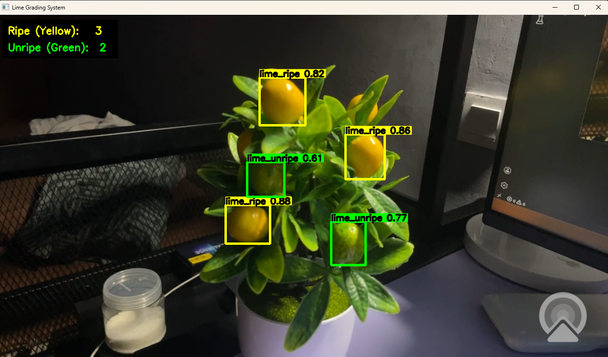

# Vision Subsystem for Automated Lime Harvesting Robot



This repository contains the computer vision module developed for an automated lime-picking robotic arm. By utilizing YOLOv11, this system acts as the "eyes" of the robot. It processes live camera feeds to detect lime fruits and classify them as **ripe** or **unripe** in real-time, providing the essential visual data required to guide a robotic manipulator during the harvesting process.

## Features
* **Robotic Arm Integration Readiness:** Detects targets and generates bounding box coordinates that can be mapped to physical workspace coordinates for inverse kinematics and robot path planning.
* **Real-Time Classification & Tracking:** Captures live webcam feeds to identify the ripeness state of limes instantly, complete with confidence scores.
* **Live Inventory Counting:** Features a custom real-time on-screen UI tracking the total number of ripe (yellow) and unripe (green) limes currently in the frame.
* **Custom Object Detection:** Built on the YOLO architecture, trained specifically on a custom dataset of ripe and unripe lime imagery to handle varying lighting and occlusion.

## Repository Structure
* `run_dashboard.py`: The main execution script. It initializes the camera stream, loads the custom-trained weights (`best.pt`), generates the on-screen UI, and runs the live inference to locate the limes.
* `train_val_split.py`: A data processing utility used to automatically partition image datasets into proper training and validation folders.
* `check_gpu.py`: A diagnostic tool to verify CUDA and GPU availability, ensuring the high frame rates necessary for smooth robotic control.
* `data.yaml`: The configuration file defining the dataset structure and target classes (ripe, unripe).
* `yolo11n.pt`: The base nano model weights used as the starting point for training.

## How to Run
1. Ensure your Python environment has the necessary dependencies installed (such as `ultralytics` and `opencv-python`).
2. Run the diagnostic script to confirm your system is utilizing the GPU for optimal frame rates:
   ```bash
   python check_gpu.py